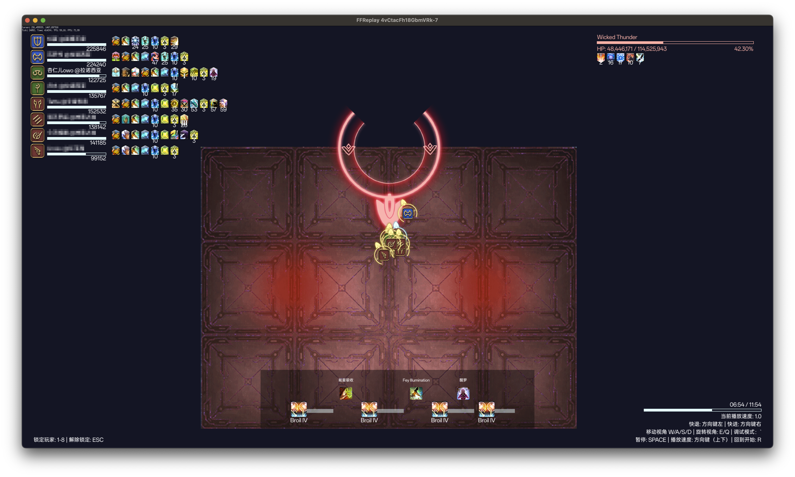

# FFXIV Replay



## 游戏内长度和像素的换算

1000 pixel = 40m

也就是游戏内 1m = 25 pixel，在添加地板素材时，请根据这个比例进行缩放。左上角显示的鼠标位置，以场地中心为原点，向右为 x 轴正方向，向下为 y 轴正方向，单位是 pixel（不随缩放变化）。

## 运行和构建

### Temporary WorldMarker API

由于 FFLogs GraphQL API 未提供标点数据，所以需要一个临时的 API 用于获取标点数据，获取的方式比较粗暴；这个 API 会在后续版本中移除（如果 FFLogs GraphQL 提供了的话）。

```bash
CGO_ENABLED=0 GOOS=linux GOARCH=amd64 go build -o markerserver ./cmd/apiserver/apiserver.go
```

应将 `internal/data/markers/markers.go` 中的 `MARKER_ENDPOINT` 常量替换为 WorldMarker API 的地址。

### FFReplay

需要配置环境变量 `CREDENTIAL`，内容与 [本地调试运行](#本地调试运行) 中的 `.credential` 文件一致。

运行构建脚本生成 WASM 版本：

```bash
sh build.sh
```

具体构建执行的过程可以查看 `build.sh` 文件，构建完成后会在 `./public` 目录下生成静态文件，可以直接部署到服务器上，或是本地启动 http 服务查看。

### 本地调试运行

首先需要 FFLogs API 所需的 ClientID 及 ClientSecret（获取方式见[官方说明](https://cn.fflogs.com/api/docs)），然后在项目根目录下创建一个 `.credential` 文件，内容如下：

```text
CLIENT_ID:CLIENT_SECRET
```

然后即可运行：

```bash
go run cmd/ffreplay/ffreplay.go -u FFLOGS_URL
# or
go run cmd/ffreplay/ffreplay.go -r REPORT_CODE -f FIGHT_ID
```

## 项目结构

该项目使用 `ebiten` 游戏引擎开发，主要原因是支持编译为 WASM，能够直接在浏览器中运行；整体架构为 ECS（Entity-Component-System），请务必熟悉这个概念。

## 数据来源

- [FFLogs](https://www.fflogs.com/)
- [ffxiv-datamining-cn](https://github.com/thewakingsands/ffxiv-datamining-cn)
- [GarlandTools](https://www.garlandtools.org)
